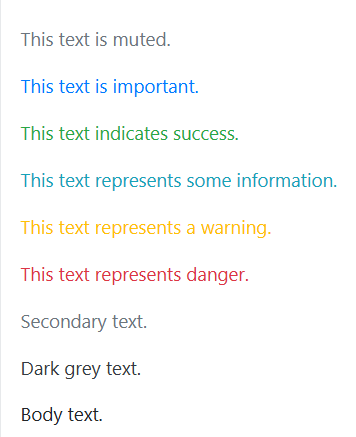
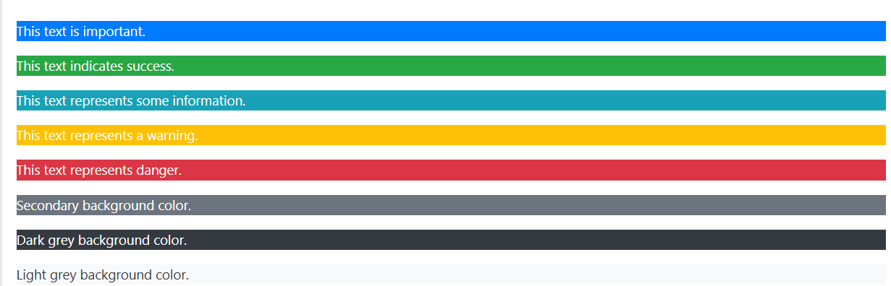
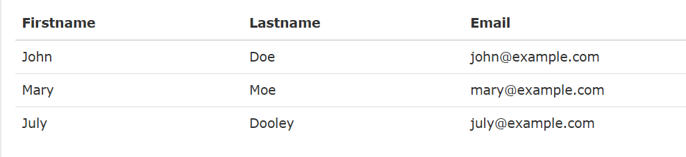
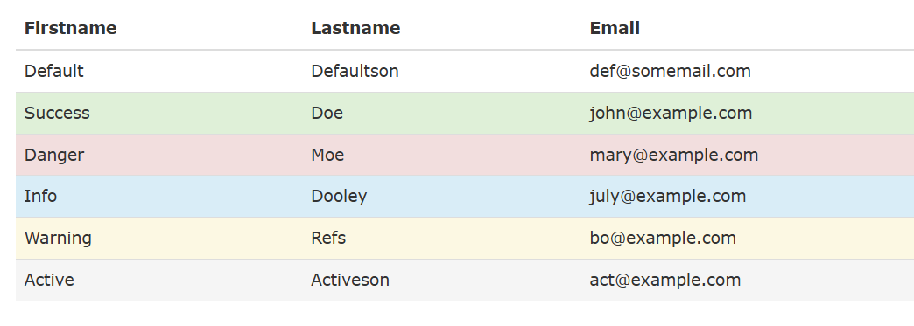
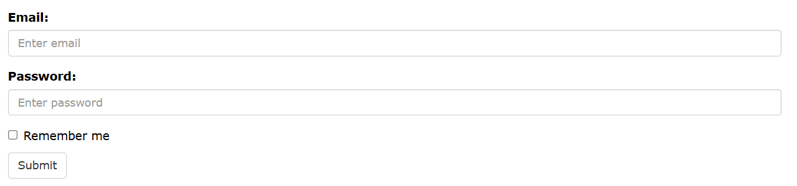
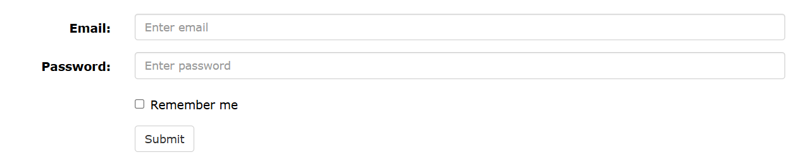

# Tài liệu ôn thi WED201c - Bootstrap

## 1. Giới thiệu về Bootstrap
- Bootstrap là một khuôn khổ front-end miễn phí giúp phát triển web nhanh hơn và dễ dàng hơn
- Bootstrap bao gồm các mẫu thiết kế dựa trên HTML và CSS cho kiểu chữ, biểu mẫu, nút, bảng, điều hướng, hộp thoại, băng chuyền hình ảnh và nhiều thứ khác, cũng như các plugin JavaScript tùy chọn
- Bootstrap được sủ dụng như 1 file CSS thông thường

## 2. Container
Bootstrap cũng yêu cầu một phần tử chứa để bao bọc nội dung trang web.

Có hai lớp container để lựa chọn:

- Lớp .container cung cấp một container có chiều rộng cố định phản hồi
- Lớp .container-fluid cung cấp một container có chiều rộng đầy đủ, trải dài toàn bộ chiều rộng của khung nhìn
```html
<div class="container-fluid">
  <h1>Hello World!</h1>
<div>
```

## 2. Bootstrap Grid
### 2.1 Hệ thống lưới (Grid System) trong Bootstrap
#### Hệ thống lưới của Bootstrap cho phép tối đa 12 cột trên toàn trang. Có thể chia nhỏ hệ thống lưới để sử dụng theo bảng sau:


### 2.2 Grid Classes
#### Hệ thống lưới Bootstrap có bốn class:
- xs (dành cho điện thoại - màn hình rộng dưới 768px)
- sm (dành cho máy tính bảng - màn hình rộng bằng hoặc lớn hơn 768px)
- md (dành cho máy tính xách tay nhỏ - màn hình rộng bằng hoặc lớn hơn 992px) - Ưu tiên xài md cho thi WED201c
- lg (dành cho máy tính xách tay và máy tính để bàn - màn hình rộng bằng hoặc lớn hơn 1200px)

### 2.3 Basic structure
```html
<div class="row"> <!-- Bên trong class "row" thì mới có 12 cột -->
  <div class="col-*-*"></div> <!-- * đầu tiên là class, * tiếp theo là độ dài của lưới -->
  <div class="col-*-*"></div>
</div>
<div class="row">
  <div class="col-*-*"></div>
  <div class="col-*-*"></div>
  <div class="col-*-*"></div>
</div>
<div class="row">
  ...
</div>
```

## 3. Color
### 3.1 Text Colors
#### Bootstrap 4 có một số lớp ngữ cảnh có thể được sử dụng để cung cấp "ý nghĩa thông qua màu sắc".

#### Các lớp cho màu chữ là: .text-muted, .text-primary, .text-success, .text-info, .text-warning, .text-danger, .text-secondary, .text-white, .text-dark, .text-body (màu nội dung mặc định/thường là màu đen) và .text-light.

#### Ví dụ


### 3.2 Background Colors
#### Các lớp cho màu nền là: .bg-primary, .bg-success, .bg-info, .bg-warning, .bg-danger, .bg-secondary, .bg-dark và .bg-light.

#### Lưu ý rằng màu nền không đặt màu chữ, vì vậy trong một số trường hợp, bạn sẽ muốn sử dụng chúng cùng với lớp .text-*.


## 4. Table
### 4.1 Table
#### Bảng Bootstrap cơ bản có phần đệm sáng và chỉ có các đường phân cách ngang.

#### Class .table thêm kiểu dáng cơ bản vào bảng.

#### Ví dụ:


### 4.2 Contextual Classes
```html
Các lớp ngữ cảnh có thể được sử dụng để tô màu các hàng bảng (<tr>) hoặc các ô bảng (<td>).
```


#### Các contextual Classes có thể sử dụng
- .active: Áp dụng màu hover cho hàng bảng hoặc ô bảng
- .success: Cho biết một hành động thành công hoặc tích cực
- .info: Cho biết một thay đổi hoặc hành động thông tin trung lập
- .warning: Cho biết một cảnh báo có thể cần chú ý
- .danger: Cho biết một hành động nguy hiểm hoặc có khả năng tiêu cực

## 5. Forms
### 5.1 Bootstrap Form Layouts
#### Bootstrap cung cấp ba loại bố cục biểu mẫu:

- Biểu mẫu dọc (đây là mặc định)
- Biểu mẫu ngang
- Biểu mẫu nội tuyến
#### Các quy tắc chuẩn cho cả ba bố cục biểu mẫu:
```html
- Bao quanh nhãn và điều khiển biểu mẫu trong <div class="form-group"> (cần thiết cho khoảng cách tối ưu)
- Thêm lớp .form-control vào tất cả các thành phần <input>, <textarea> và <select> dạng văn bản
```
### 5.2 Bootstrap Vertical Form (mặc định)


### 5.3 Bootstrap Inline Form


### 5.4 Bootstrap Horizontal Form


## 6. Button
### 6.1 Button Styles

#### Bootstrap cung cấp các kiểu nút khác nhau:

- .btn
- .btn-default
- .btn-primary
- .btn-success
- .btn-info
- .btn-warning
- .btn-danger
- .btn-link

#### Ví dụ
```html
<button type="button" class="btn">Basic</button>
<button type="button" class="btn btn-default">Default</button>
<button type="button" class="btn btn-primary">Primary</button>
<button type="button" class="btn btn-success">Success</button>
<button type="button" class="btn btn-info">Info</button>
<button type="button" class="btn btn-warning">Warning</button>
<button type="button" class="btn btn-danger">Danger</button>
<button type="button" class="btn btn-link">Link</button>
```

### 6.2 Button Sizes
#### Bootstrap cung cấp các kích cỡ nút khác nhau:


- .btn-lg
- .btn-sm
- .btn-xs

```html
<button type="button" class="btn btn-primary btn-lg">Large</button>
<button type="button" class="btn btn-primary">Normal</button>
<button type="button" class="btn btn-primary btn-sm">Small</button>
<button type="button" class="btn btn-primary btn-xs">XSmall</button>
```

## 7. Navbar
