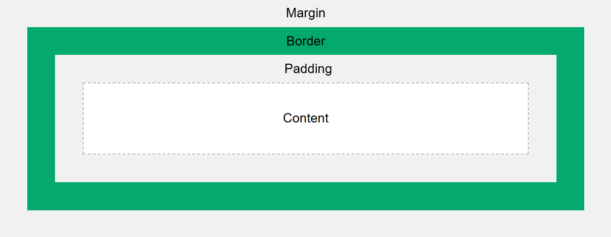

# FILE TÀI LIỆU ĐƯỢC TỔNG HỢP BỞI TEAM CỦA MINTHEP
# Tài liệu ôn thi WED201c - Lập trình CSS

## 1. Giới thiệu về CSS
- CSS (Cascading Style Sheets)
- CSS không phải là một ngôn ngữ lập trình
- CSS là ngôn ngữ định dạng thuộc tính cho các thẻ html (hiển thị các thẻ html)
- CSS dùng để  biểu diễn, trang trí bố cục cho 1 trang web

## 2. Cú pháp CSS
Một quy tắc CSS bao gồm selector (bộ chọn) và declaration block (khối khai báo):
```css
selector {
    property: value;
}
```
- selector: Chọn phần tử để áp dụng định dạng.
- property: Thuộc tính cần định dạng (ví dụ: color, font-size).
- value: Giá trị của thuộc tính.

## 3. Các cách chèn CSS

Có ba cách để chèn một style sheet vào tài liệu HTML:

1. External CSS
2. Internal CSS
3. Inline CSS

### 3.1 External CSS

Với một style sheet bên ngoài, bạn có thể thay đổi giao diện của toàn bộ website chỉ bằng cách thay đổi một file duy nhất!

Mỗi trang HTML phải bao gồm một tham chiếu đến file style sheet bên ngoài bên trong thẻ `<link>` ở phần `<head>`.

#### Ví dụ

Style sheet bên ngoài được định nghĩa trong thẻ `<link>`, nằm bên trong phần `<head>` của trang HTML:

```html
<!DOCTYPE html>
<html>
<head>
  <link rel="stylesheet" href="mystyle.css">
</head>
<body>

  <h1>This is a heading</h1>
  <p>This is a paragraph.</p>

</body>
</html>
```
Lưu ý: File .css bên ngoài không nên chứa bất kỳ thẻ HTML nào.

#### Ví dụ về file "mystyle.css":
```css
body {
  background-color: lightblue;
}

h1 {
  color: navy;
  margin-left: 20px;
}
```
Lưu ý: Không thêm khoảng trắng giữa giá trị thuộc tính và đơn vị (px):
- Sai (có khoảng trắng): margin-left: 20 px;
- Đúng (không có khoảng trắng): margin-left: 20px;
### 3.2 Internal CSS
Style sheet bên trong có thể được sử dụng nếu một trang HTML duy nhất có một phong cách độc nhất.

Style bên trong được định nghĩa trong thẻ `<style>` bên trong phần `<head>`.

#### Ví dụ
Style sheet bên trong được định nghĩa trong thẻ `<style>` bên trong phần `<head>` của trang HTML:

```html
<!DOCTYPE html>
<html>
<head>
  <style>
    body {
      background-color: linen;
    }

    h1 {
      color: maroon;
      margin-left: 40px;
    }
  </style>
</head>
<body>

  <h1>This is a heading</h1>
  <p>This is a paragraph.</p>

</body>
</html>
```
### 3.3 Inline CSS
Style inline có thể được sử dụng để áp dụng một phong cách duy nhất cho một phần tử.

Để sử dụng style inline, thêm thuộc tính style vào phần tử tương ứng. Thuộc tính style có thể chứa bất kỳ thuộc tính CSS nào.

#### Ví dụ
Style inline được định nghĩa trong thuộc tính style của phần tử tương ứng:

```html
<!DOCTYPE html>
<html>
<body>

  <h1 style="color:blue;text-align:center;">This is a heading</h1>
  <p style="color:red;">This is a paragraph.</p>

</body>
</html>
```
Lưu ý: Style inline mất đi nhiều ưu điểm của một style sheet (vì trộn nội dung với trình bày). Hãy sử dụng phương pháp này một cách hạn chế.

### Multiple Style Sheets
Nếu một số thuộc tính đã được định nghĩa cho cùng một bộ chọn (selector) trong các style sheet khác nhau, giá trị từ style sheet cuối cùng được đọc sẽ được sử dụng.

#### Ví dụ
Giả sử một style sheet bên ngoài có định nghĩa sau cho phần tử `<h1>`:

```css
h1 {
  color: navy;
}
```
Sau đó, giả sử một style sheet bên trong cũng có định nghĩa sau cho phần tử `<h1>`:

```css
h1 {
  color: orange;
}
```
Nếu style sheet bên trong được định nghĩa sau liên kết đến style sheet bên ngoài, các phần tử `<h1>` sẽ có màu "orange":

```html
<head>
  <link rel="stylesheet" type="text/css" href="mystyle.css">
  <style>
    h1 {
      color: orange;
    }
  </style>
</head>
```
#### Ví dụ ngược lại
Tuy nhiên, nếu style sheet bên trong được định nghĩa trước liên kết đến style sheet bên ngoài, các phần tử `<h1>` sẽ có màu "navy":

```html
<head>
  <style>
    h1 {
      color: orange;
    }
  </style>
  <link rel="stylesheet" type="text/css" href="mystyle.css">
</head>
```

## 4. Màu sắc trong CSS

Trong CSS, có nhiều cách để định nghĩa màu sắc. Hai cách phổ biến nhất là sử dụng mã HEX và RGB.

### 4.1 Mã màu HEX

Mã màu HEX được biểu diễn bằng ký hiệu # theo sau là 6 chữ số hoặc ký tự, trong đó:
- 2 chữ số đầu biểu thị màu đỏ (Red)
- 2 chữ số giữa biểu thị màu xanh lá (Green) 
- 2 chữ số cuối biểu thị màu xanh dương (Blue)

Mỗi cặp số có giá trị từ 00 đến FF (tương đương 0-255 trong hệ thập phân)

Ví dụ:
- #FF0000 là màu đỏ (Red = FF, Green = 00, Blue = 00)
- #00FF00 là màu xanh lá (Red = 00, Green = FF, Blue = 00) 
- #0000FF là màu xanh dương (Red = 00, Green = 00, Blue = FF)
- #000000 là màu đen
- #FFFFFF là màu trắng

### 4.2 Mã màu RGB

RGB (Red, Green, Blue) là một cách khác để xác định màu sắc trong CSS. Mỗi tham số (red, green và blue) xác định cường độ của màu với giá trị từ 0 đến 255.

Cú pháp: rgb(red, green, blue)

Ví dụ:
- rgb(255, 0, 0) là màu đỏ
- rgb(0, 255, 0) là màu xanh lá
- rgb(0, 0, 255) là màu xanh dương
- rgb(0, 0, 0) là màu đen
- rgb(255, 255, 255) là màu trắng

Ngoài ra còn có rgba() cho phép thêm giá trị alpha (độ trong suốt) từ 0.0 (hoàn toàn trong suốt) đến 1.0 (hoàn toàn đục).

Ví dụ: rgba(255, 0, 0, 0.5) là màu đỏ với độ trong suốt 50%
## 5. Backgrounds
#### Thuộc tính Background CSS được sử dụng để thêm hiệu ứng nền cho các thành phần.
- background-color: chỉ định màu nền cho 1 phần tử
- background-image: chỉ định ảnh dùng làm nền cho 1 phần tử
- background-repeat: lặp lại hình ảnh theo cả chiều ngang và chiều dọc
- background-attachment: chỉ định hình ảnh nền sẽ cuộn hay cố định (sẽ không cuộn cùng phần còn lại của trang)
- background-position: Chỉ định vị trí của image

Ví dụ:
```css
body {
  background-color: #ffffff;
  background-image: url("img_tree.png");
  background-repeat: no-repeat;
  background-attachment: fixed;
  background-position: right top;
}
```

Hoặc viết tắt theo thứ tự:
- background-color
- background-image
- background-repeat
- background-attachment
- background-position
```css
body {
  background: #ffffff url("img_tree.png") no-repeat fixed right top;
}
```
## 6. Border (Viền)
#### Thuộc tính Border dùng để chỉ định kiểu, chiều rộng và màu của đường viền phần tử.
- Border-width: chỉ định chiều rộng của bốn đường viền.
- Border-style (bắt buộc): chỉ định loại đường viền nào sẽ hiển thị.
- Border-color: chỉ định màu của đường viền.
#### Ví dụ chi tiết về các thuộc tính ở code css

Ví dụ:
```css
p {
  border-width: 5px;
  Border-style: solid;
  Border-color: red;
}
```

Hoặc viết tắt theo thứ tự trên:
```css
p {
  border: 5px solid red;
}
```
## 7. Margin
#### Thuộc tính margin của CSS được sử dụng để tạo khoảng trống xung quanh các phần tử, bên ngoài đường viền.
#### Thuộc tính:
- margin-top
- margin-right
- margin-bottom
- margin-left
#### Giá trị:
Tất cả các thuộc tính margin có thể có các giá trị sau:
- auto
- length (px, pt, cm, ...) (Thường được sử dụng)
- %
- inherit

Ví dụ:
```css
p {
  margin-top: 100px;
  margin-bottom: 100px;
  margin-right: 150px;
  margin-left: 80px;
}
```

Viết tắt theo thứ tự trên:
```css
p {
  margin: 25px 50px 75px 100px;
}
```

## 8. Padding
#### Padding được sử dụng để tạo khoảng trống xung quanh nội dung của phần tử, bên trong đường viền.
#### Thuộc tính:
- padding-top
- padding-right
- padding-bottom
- padding-left
#### Giá trị:
Tất cả các thuộc tính padding có thể có các giá trị sau:
- auto
- length (px, pt, cm, ...) (Thường được sử dụng)
- %
- inherit

Ví dụ:
```css
p {
  padding-top: 100px;
  padding-bottom: 100px;
  padding-right: 150px;
  padding-left: 80px;
}
```

Viết tắt theo thứ tự trên:
```css
p {
  padding: 25px 50px 75px 100px;
}
```

#### Ảnh minh họa Border, Margin và Padding


## 9. Text
### 9.1 Text Alignment
#### Thuộc tính text-align được sử dụng để căn chỉnh theo chiều ngang của văn bản.
#### Một văn bản có thể được căn trái hoặc phải, căn giữa hoặc căn đều.

Ví dụ:
```css
h1 {
  text-align: center;
}
h2 {
  text-align: left;
}
h3 {
  text-align: right;
}
div {
  text-align: justify;
}
```
### 9.2 Text Decoration
#### Các thuộc tính:
- text-decoration-line
- text-decoration-color
- text-decoration-style
- text-decoration-thickness
- text-decoration

#### Thuộc tính text-decoration-line được sử dụng để thêm đường trang trí vào văn bản.
```css
h1 {
  text-decoration-line: overline;
}

p {
  text-decoration-line: overline underline;
}
```

#### Thuộc tính text-decoration-color được sử dụng để thiết lập màu của đường trang trí.
```css
h1 {
  text-decoration-line: overline;
  text-decoration-color: red;
}
```

#### Thuộc tính text-decoration-style được sử dụng để thiết lập kiểu của đường trang trí.
```css
h1 {
  text-decoration-line: underline;
  text-decoration-style: solid;
}
```

#### Thuộc tính text-decoration-thickness được sử dụng để thiết lập độ dày của đường trang trí.
```css
h1 {
  text-decoration-line: underline;
  text-decoration-thickness: 5px;
}
```

#### Thuộc tính text-decoration là một thuộc tính viết tắt theo thứ tự phía trên.
```css
p {
  text-decoration: underline red double 5px;
}
```

## 10. Position
### Thuộc tính position chỉ định loại phương pháp định vị được sử dụng cho một phần tử.
Có năm giá trị vị trí khác nhau:

- static
- relative
- fixed
- absolute
- sticky

Sau đó, các phần tử được định vị bằng các thuộc tính top, bottom, left và right. Tuy nhiên, các thuộc tính này sẽ không hoạt động trừ khi thuộc tính position được đặt trước. Chúng cũng hoạt động khác nhau tùy thuộc vào giá trị position.

# AUTHOR: Minthep
### 10.1 Static
#### Các phần tử HTML được định vị tĩnh theo mặc định.
#### Các phần tử được định vị tĩnh không bị ảnh hưởng bởi các thuộc tính top, bottom, left và right.
#### Một phần tử có position: static; không được định vị theo bất kỳ cách đặc biệt nào; nó luôn được định vị theo luồng thông thường của trang

```css
div.static {
  position: static;
  border: 3px solid #73AD21;
}
```
### 10.2 Relative

#### Một phần tử có position: relative; được định vị tương đối so với vị trí bình thường của nó.
#### Thiết lập các thuộc tính top, right, bottom và left của một phần tử được định vị tương đối sẽ khiến nó được điều chỉnh ra khỏi vị trí bình thường của nó. Nội dung khác sẽ không được điều chỉnh để vừa với bất kỳ khoảng trống nào do phần tử để lại.

```css
div.relative {
  position: relative;
  left: 30px;
  border: 3px solid #73AD21;
}
```

### 10.3 Fixed

#### Một phần tử có position: fixed; được định vị tương đối với khung nhìn, nghĩa là nó luôn ở cùng một vị trí ngay cả khi trang được cuộn. Các thuộc tính top, right, bottom và left được sử dụng để định vị phần tử.
#### Một phần tử cố định không để lại khoảng trống trên trang nơi mà nó thường được đặt.
#### Lưu ý phần tử cố định ở góc dưới bên phải của trang.

```css
div.fixed {
  position: fixed;
  bottom: 0;
  right: 0;
  width: 300px;
  border: 3px solid #73AD21;
}
```

### 10.4 Absolute

#### Một phần tử có vị trí: tuyệt đối; được định vị tương đối với tổ tiên được định vị gần nhất (thay vì được định vị tương đối với khung nhìn, như cố định).
#### Tuy nhiên; nếu một phần tử được định vị tuyệt đối không có tổ tiên được định vị, nó sẽ sử dụng phần thân tài liệu và di chuyển cùng với việc cuộn trang.
#### Lưu ý: Các phần tử được định vị tuyệt đối sẽ bị xóa khỏi luồng bình thường và có thể chồng lên các phần tử khác.
```css
div.absolute {
  position: absolute;
  top: 80px;
  right: 0;
  width: 200px;
  height: 100px;
  border: 3px solid #73AD21;
}
```
### 10.5 Sticky

#### Một phần tử có position: sticky; được định vị dựa trên vị trí cuộn của người dùng.
#### Một phần tử sticky chuyển đổi giữa relative và fixed, tùy thuộc vào vị trí cuộn. Nó được định vị tương đối cho đến khi gặp một vị trí bù trừ nhất định trong khung nhìn - sau đó nó "dính" vào vị trí (giống như position:fixed).

```css
div.sticky {
  position: sticky;
  top: 0;
  background-color: green;
  border: 2px solid #4CAF50;
}
```

## 11. Pseudo-Classes

#### Một pseudo-class được sử dụng để xác định trạng thái đặc biệt của một phần tử.

Ví dụ, nó có thể được sử dụng để:

- Định dạng một phần tử khi người dùng di chuyển chuột qua phần tử đó
- Định dạng các liên kết đã truy cập và chưa truy cập khác nhau
- Định dạng một phần tử khi nó được lấy nét
- Định dạng các phần tử biểu mẫu hợp lệ/không hợp lệ/bắt buộc/tùy chọn

#### Cú pháp:
```css
selector:pseudo-class {
  property: value;
}
```

#### Ví dụ:
```css
a:link {
  color: #FF0000;
}

a:visited {
  color: #00FF00;
}

a:hover {
  color: #FF00FF;
}

a:active {
  color: #0000FF;
}
```
Lưu ý: Các thuộc tính của Pseudo-Classes phải được dùng theo thứ tự trên 

#### Pseudo-classes có thể được kết hợp với HTML classes
```css
a.highlight:hover {
  color: #ff0000;
}
```

## 12. Inline-Block
#### Có 3 cách để hiển thị 1 block trong 1 đoạn văn bản
- display: inline-block
- display: inline
- display: block

So với display: inline, điểm khác biệt chính là display: inline-block cho phép đặt chiều rộng và chiều cao trên phần tử. Ngoài ra, với display: inline-block, lề/khoảng đệm trên cùng và dưới cùng được áp dụng, nhưng với display: inline thì không.

So với display: block, điểm khác biệt chính là display: inline-block không thêm ngắt dòng sau phần tử, do đó phần tử có thể nằm cạnh các phần tử khác.

## 13. Đơn vị đo trong CSS
CSS có nhiều đơn vị đo khác nhau, nhưng 3 đơn vị quan trọng nhất là px, em và rem:

### 13.1 Pixel (px)
- Là đơn vị **tuyệt đối**, cố định
- 1px = 1 điểm ảnh trên màn hình
- Không thay đổi khi zoom trang web
```css
.box {
    width: 100px;      /* Luôn cố định 100 pixel */
    font-size: 16px;   /* Luôn cố định 16 pixel */
}
```

### 13.2 Em (em)
- Là đơn vị **tương đối**
- Phụ thuộc vào font-size của phần tử **cha gần nhất**
- 1em = 100% font-size của phần tử cha
```css
.parent {
    font-size: 20px;
}
.child {
    font-size: 1.5em;   /* = 20px * 1.5 = 30px */
    padding: 1em;       /* = 30px (dựa vào font-size của chính nó) */
}
```

### 13.3 Root Em (rem)
- Là đơn vị **tương đối**
- Phụ thuộc vào font-size của thẻ **html (root)**
- Mặc định: 1rem = 16px
```css
html {
    font-size: 16px;
}
.box {
    font-size: 1.5rem;   /* = 16px * 1.5 = 24px */
    margin: 2rem;        /* = 16px * 2 = 32px */
}
```

### 13.4 Khi nào dùng đơn vị nào?
1. **px**: 
   - Dùng cho border
   - Dùng cho kích thước ảnh
   - Khi cần độ chính xác cao

2. **em**: 
   - Dùng cho padding, margin trong component
   - Khi muốn kích thước tỷ lệ với phần tử cha

3. **rem**:
   - Dùng cho font-size
   - Dùng cho layout tổng thể
   - Dễ responsive toàn trang

# FILE TÀI LIỆU ĐƯỢC TỔNG HỢP BỞI TEAM CỦA MINTHEp
# AUTHOR: Minthep