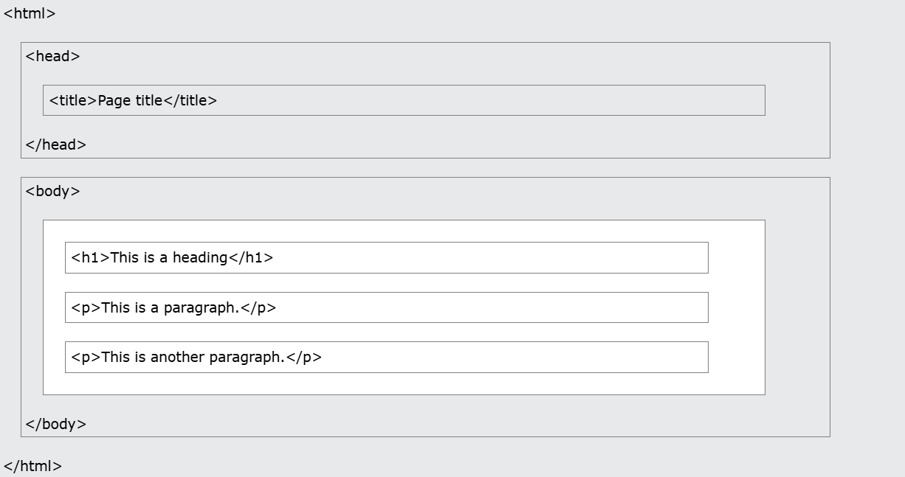
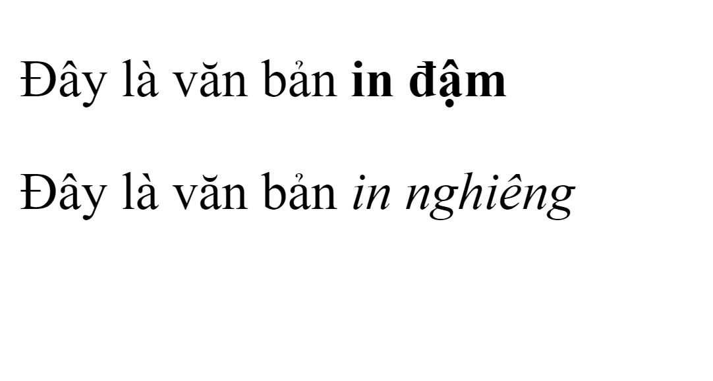
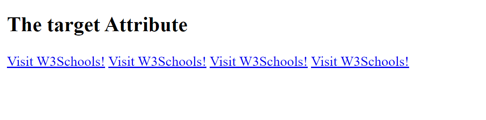
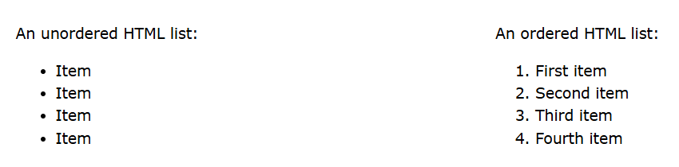
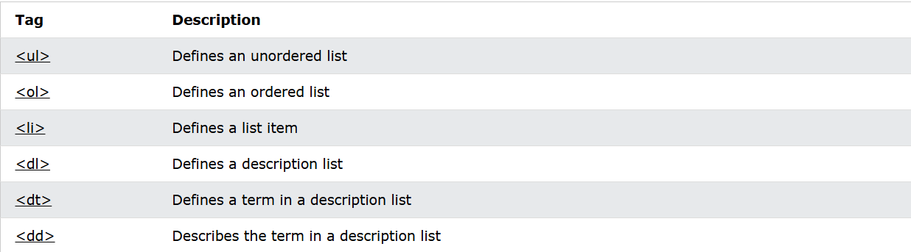
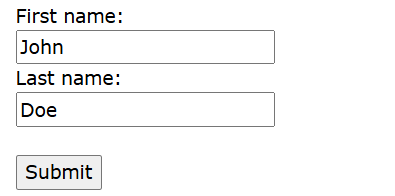

# Tài liệu ôn thi WED201c - Lập trình CSS
## 1. HTML là gì?

- HTML là viết tắt của cụm từ Hypertext Markup Language (tạm dịch là Ngôn ngữ đánh dấu siêu văn bản)
- HTML không phải là ngôn ngữ lập trình
- HTML được hình thành từ các phần tử (elements) được quy định bằng các cặp thẻ mở và đóng (ví dụ: `<html></html>`)
- Một số thẻ HTML sẽ ra thi không cần thẻ đóng (empty elements/void elements):
  - `` - Thẻ chèn hình ảnh
  - `<br>` - Thẻ xuống dòng
  - `<hr>` - Thẻ tạo đường kẻ ngang
  - `<input>` - Thẻ nhập liệu
  - `<meta>` - Thẻ metadata trong head
  - `<link>` - Thẻ liên kết tài nguyên bên ngoài
  - Tips: khi ghi các thẻ này ra thì mặc định không có thẻ đóng nên khoải nhớ hehe


## 2. Cú pháp HTML
Một trang HTML cơ bản sẽ có cấu trúc như sau:

```html
<!DOCTYPE html>
<html>
<head>
  <title>Page Title</title>
</head>
<body>
  <h1>This is a heading</h1>
  <p>This is a paragraph.</p>
</body>
</html>
```

#### Giải thích từng thẻ một cách đơn giản:

```html
1. <!DOCTYPE html>
- Đây là dòng khai báo đầu tiên của mọi trang web
- Cho trình duyệt biết đây là trang web viết bằng HTML5

2. <html>
- Là thẻ "cha" của tất cả các thẻ khác
- Giống như một cái hộp lớn nhất chứa mọi thứ trong trang web

3. <head>
- Chứa thông tin về trang web (không hiển thị trực tiếp cho người dùng thấy)
- Ví dụ: tiêu đề tab, liên kết CSS, các thông tin mô tả trang web,...

4. <title>
- Nằm trong <head>
- Hiển thị tên của trang web trên tab trình duyệt

5. <body>
- Chứa tất cả nội dung hiển thị trên trang web
- Mọi thứ người dùng nhìn thấy đều nằm trong thẻ này: text, hình ảnh, nút bấm,...

6. <h1> và <p>
- <h1>: Dùng để tạo tiêu đề lớn
- <p>: Dùng để tạo đoạn văn bản
- Đây chỉ là ví dụ, trong <body> có thể chứa rất nhiều thẻ khác
7. SEO (Search Engine Optimization) là quá trình tối ưu hóa website để tăng khả năng hiển thị trên các công cụ tìm kiếm như Google, Bing,... một cách tự nhiên (không phải quảng cáo trả tiền).
```
#### Một số câu hỏi người thường không thể hỏi được:
##### "Tại sao phải có DOCTYPE?"
```html
<!DOCTYPE html>  <!-- Bỏ dòng này vẫn chạy được mà? -->
<html>
```
- **Thực tế**: Không có DOCTYPE → trình duyệt vào "quirks mode - Cách cũ"
- **Hậu quả**: Layout vỡ trên một số trình duyệt
- **Best practice**: Luôn thêm DOCTYPE để đảm bảo trang web hiển thị nhất quán

##### "Nếu bỏ `<head>` thì vẫn chạy được, tại sao lại cần `<head>`?"

- Không có `<title>` → tab trình duyệt sẽ hiển thị URL thay vì tên trang
- Không thể thêm CSS external → không style được 
- Không thể thêm meta tags → SEO kém
- Không thể thêm favicon → không có icon cho tab

##### "Vậy trình duyệt xử lý thế nào khi không có `<head>`?"

- Trình duyệt tự động tạo thẻ `<head>` ngầm
- Mọi thẻ `<title>`, `<meta>`, `<link>` sẽ tự động được chuyển vào `<head>` ẩn này

##### "Có thể đặt `<title>` trong `<body>` không?"

- Thử đi! Code vẫn chạy
- NHƯNG trình duyệt sẽ tự động di chuyển nó vào `<head>` ẩn
- Không theo chuẩn HTML → không nên làm
#### Cấu trúc HTML



## 3. Định dạng văn bản
#### Các thành phần định dạng được thiết kế để hiển thị các loại văn bản đặc biệt:
**Semantic HTML** là việc sử dụng các thẻ HTML mang ý nghĩa về mặt ngữ nghĩa, giúp:
- Trình duyệt và công cụ tìm kiếm hiểu được nội dung
- Người khuyết tật có thể dùng phần mềm đọc màn hình tốt hơn
- Code dễ bảo trì và đọc hiểu hơn
```html
<b> - Bold text
<strong> - Important text
<i> - Italic text
<u> - Underline text
```

## 4. Links - Hyperlinks
#### Liên kết HTML là siêu liên kết. Chúng cho phép người dùng di chuyển từ trang web này sang trang web khác, hoặc đến một vị trí khác trên cùng một trang.
Lưu ý: Liên kết không nhất thiết phải là văn bản. Liên kết có thể là hình ảnh, nút bấm hoặc bất kỳ thành phần HTML nào khác!

### 4.1 Cú pháp links
```html
<a href="url">link text</a>
```
Ví dụ
```html
<p><a href="https://www.w3schools.com/">Visit W3Schools.com!</a></p>
```

#### Theo mặc định, các liên kết sẽ xuất hiện như sau trong tất cả các trình duyệt:

- Liên kết chưa được truy cập có gạch chân và màu xanh lam
- Liên kết đã truy cập có gạch chân và màu tím
- Liên kết đang hoạt động có gạch chân và màu đỏ

### 4.2 Thuộc tính Target

#### Theo mặc định, trang được liên kết sẽ được hiển thị trong cửa sổ trình duyệt hiện tại. Để thay đổi điều này, bạn phải chỉ định một mục tiêu khác cho liên kết.

#### Thuộc tính target chỉ định nơi mở tài liệu được liên kết.   

#### Thuộc tính target có thể có một trong các giá trị sau:

- _self - Mặc định. Mở tài liệu trong cùng một cửa sổ/tab nơi nó được nhấp   
- _blank - Mở tài liệu trong một cửa sổ hoặc tab mới
- _parent - Mở tài liệu trong khung cha
- _top - Mở tài liệu trong toàn bộ nội dung của cửa sổ

## 5. Hình ảnh
### 5.1 Cú pháp
```html
Thẻ  trong HTML được sử dụng để nhúng hình ảnh vào trang web.

Về mặt kỹ thuật, hình ảnh không được chèn vào trang web; hình ảnh được liên kết với các trang web. Thẻ  tạo ra một không gian chứa cho hình ảnh được tham chiếu.

Thẻ  có hai thuộc tính chính:
    src - Chỉ định đường dẫn đến hình ảnh
    alt - Chỉ định văn bản thay thế cho hình ảnh
```
```html

```
- Thuộc tính 'src'  chỉ định đường dẫn (URL) đến hình ảnh.
- Thuộc tính 'alt'  cung cấp một văn bản thay thế cho hình ảnh, nếu vì lý do nào đó người dùng không thể xem nó (do kết nối chậm, lỗi trong thuộc tính src hoặc nếu người dùng sử dụng trình đọc màn hình).
- Thuộc tính 'tile' giúp hiển thị nội dung khi người dùng di trỏ chuột vào hình ảnh

## 6. Lists
#### Danh sách HTML cho phép nhóm một tập hợp các mục có liên quan vào danh sách.

### 6.1 Unordered List
```html
- Danh sách HTML không có thứ tự
- Danh sách không có thứ tự bắt đầu bằng thẻ <ul>. Mỗi mục danh sách bắt đầu bằng thẻ <li>
```
Ví dụ:
```html
<ul>
  <li>Coffee</li>
  <li>Tea</li>
  <li>Milk</li>
</ul>
```
<ul>
  <li>Coffee</li>
  <li>Tea</li>
  <li>Milk</li>
</ul>

### 6.2 Ordered List
```html
- Danh sách HTML có thứ tự
- Danh sách có thứ tự bắt đầu bằng thẻ <ol>. Mỗi mục danh sách bắt đầu bằng thẻ <li>
```
Ví dụ:
```html
<ol>
  <li>Coffee</li>
  <li>Tea</li>
  <li>Milk</li>
</ol>
```

<ol>
  <li>Coffee</li>
  <li>Tea</li>
  <li>Milk</li>
</ol>

### HTML List Tag


## 8. Thẻ Span và Div

- Thẻ `<div>`: Dùng để gom nhóm các phần tử thành một khối (block-level element).
  - **Đặc điểm**: Mỗi thẻ `<div>` sẽ nằm trên một dòng riêng biệt.
  - **Ưu điểm**: Dễ dàng tách các hình ảnh, văn bản thành các khối riêng biệt trên từng dòng.

- Thẻ `<span>`: Dùng để nhóm các phần tử mà không tạo thành một khối (inline element).
  - **Đặc điểm**: Các thẻ `<span>` vẫn nằm trên cùng một dòng.
  - **Ưu điểm**: Thay đổi thuộc tính của các phần tử mà không cần tách xuống dòng.

## 9. Forms (PHUC VU CHO DE CO HTML)
#### HTML Form được sử dụng để thu thập thông tin đầu vào của người dùng. Thông tin đầu vào của người dùng thường được gửi đến máy chủ để xử lý.

#### Ví dụ


### 9.1 Thẻ Form
```html
- Thẻ <form> trong HTML được sử dụng để tạo một biểu mẫu HTML cho đầu vào của người dùng

- Thẻ <form> là một bộ chứa cho các loại thành phần đầu vào khác nhau, chẳng hạn như: trường văn bản, hộp kiểm, nút radio, nút gửi, v.v.

Ví dụ

<form>
.
form elements
.
</form>
```

### 9.2 Thẻ Input
```html
- Thẻ <input> trong HTML là thành phần biểu mẫu được sử dụng nhiều nhất.

- Một thành phần <input> có thể được hiển thị theo nhiều cách, tùy thuộc vào thuộc tính type.
```

#### Các thuộc tính Type có thể dùng


### 9.3 Thẻ Lable
```html
Lưu ý cách sử dụng thẻ <label> trong ví dụ trên.

Thẻ <label> xác định nhãn cho nhiều thành phần biểu mẫu.

Thẻ <label> hữu ích cho người dùng trình đọc màn hình, vì trình đọc màn hình sẽ đọc to nhãn khi người dùng tập trung vào thành phần đầu vào.

Thẻ <label> cũng giúp người dùng gặp khó khăn khi nhấp vào các vùng rất nhỏ (chẳng hạn như nút radio hoặc hộp kiểm) - vì khi người dùng nhấp vào văn bản trong thẻ <label>, nó sẽ chuyển đổi nút radio/hộp kiểm.

Thuộc tính for của thẻ <label> phải bằng với thuộc tính id của thẻ <input> để liên kết chúng với nhau.
```

Ví dụ
```html
<form>
  <label for="fname">First name:</label><br>
  <input type="text" id="fname" name="fname"><br>
  <label for="lname">Last name:</label><br>
  <input type="text" id="lname" name="lname">
</form>
```

#### 2. "Tại sao một số thẻ không cần đóng?"
```html
     <!-- works -->
<br>                    <!-- works -->
<input type="text">     <!-- works -->
```
- **Lý do**: Đây là "void elements" - không có nội dung bên trong
- **Danh sách**: img, br, hr, input, meta, link
- **Tips**: Nhớ các thẻ này để viết code nhanh hơn

#### 3. "Tại sao attribute đôi khi không cần value?"
```html
<input required>                    <!-- works -->
<input required="required">         <!-- same -->
<input type="checkbox" checked>     <!-- works -->
<input type="checkbox" checked="false">  <!-- vẫn checked! -->
```
- **Quy tắc**: Sự tồn tại của attribute quan trọng hơn giá trị
- **Lưu ý**: Cẩn thận với boolean attributes

#### 4. "HTML có phân biệt hoa thường không?"
```html
<DIV> = <div>
<BODY> = <body>
<HTML> = <html>
```
- **Không**: HTML không phân biệt
- **Nhưng**: CSS và JavaScript có phân biệt
- **Convention**: Nên viết thường để dễ đọc

#### 5. "Tại sao cần alt cho img?"
```html
  <!-- Thiếu alt vẫn chạy -->
  <!-- Nên làm -->
```
- **SEO**: Google cần alt để hiểu ảnh
- **Accessibility**: Screen readers cần alt để đọc
- **UX**: Hiển thị khi ảnh lỗi

# AUTHOR: Minthep